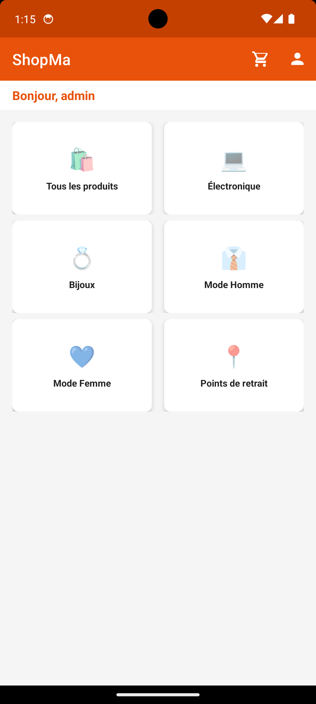
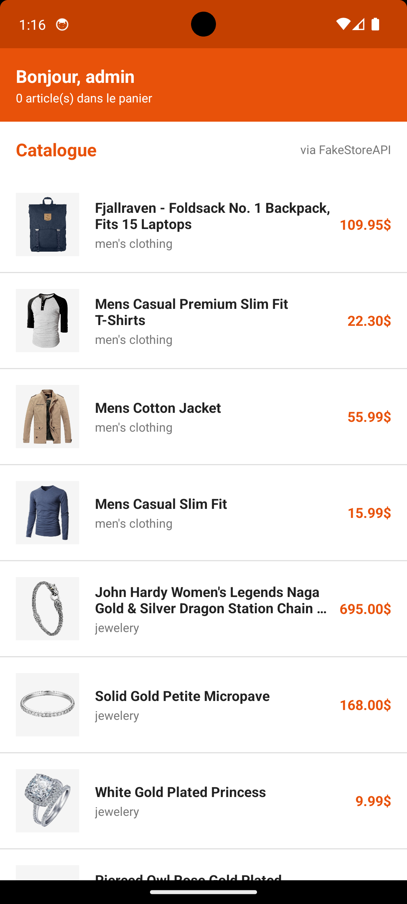
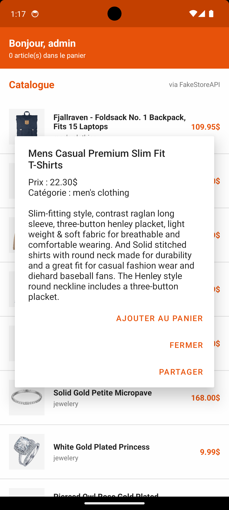
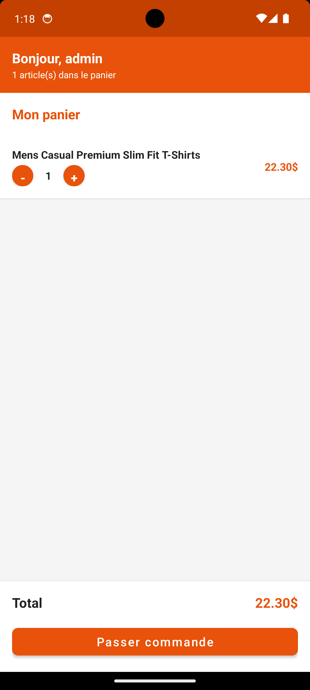
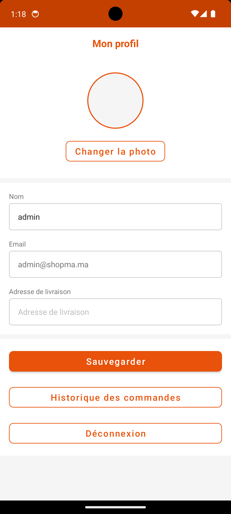
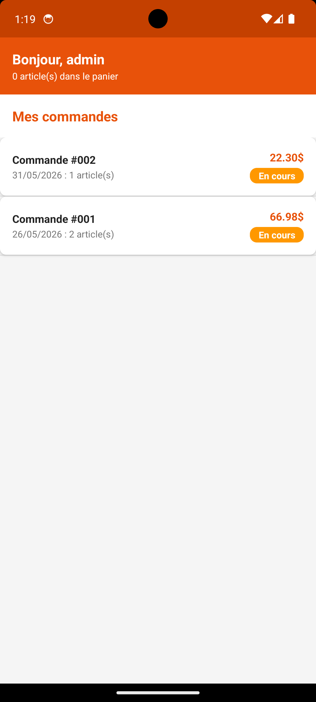
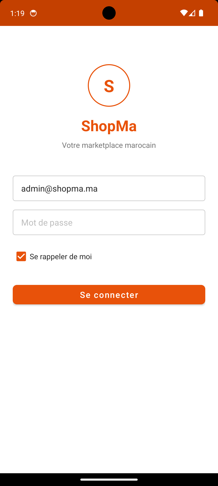

## 📱 ShopMa Mobile Application

ShopMa is a mobile shopping application designed to provide a smooth and modern e‑commerce experience.  
Below are screenshots that showcase the look and feel of the app:

### 🏠 Home & Product Listing

  
  

### 🛒 Cart & Checkout

  
  

### 👤 User Account & Orders

  
  

### ⚙️ Settings

  

## 📱 ShopMa Mobile Screenshots

  
  
  
  

